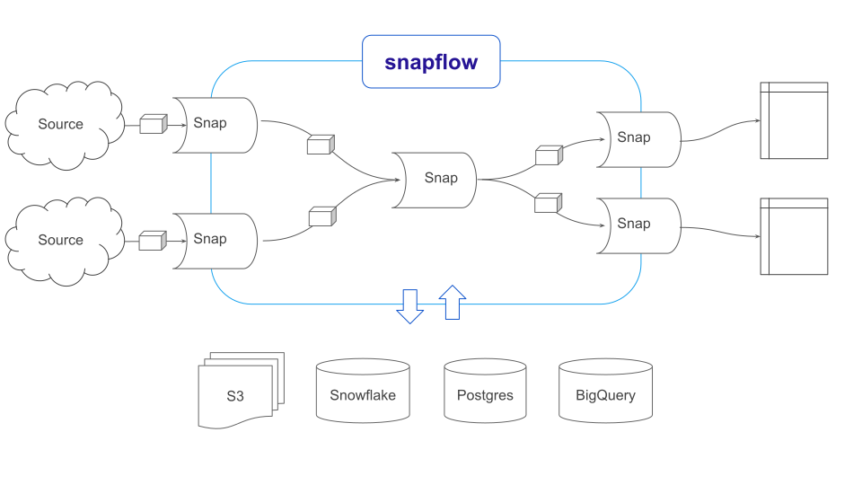

<p>&nbsp;</p>
<p align="center">
  
</p>
<h3 align="center">Composable data functions</h3>
<p>&nbsp;</p>

**Snapflow** is a framework for building **functional reactive data pipelines** from modular
components. It lets developers write gradually-typed pure data functions, called `snaps`, in **Python or SQL**
that operate reactively on `datablocks`, immutable sets of data records whose
structure and semantics are described by flexible `schemas`.
These snaps can be composed into simple or complex data
pipelines that tackle every step of the data processing pipeline, from API ingestion to transformation
to analysis and modeling.

This functional reactive framework provides powerful benefits:

- **Simple declarative graphs** — The functional reactive nature of snapflow takes the tangled, stateful
  messes of traditional ETLs and turns them into clean declarative flows of data. Complex mixes of rebuilds and
  incremental updates become simple stateless operators.

- **Reusable components** — Because they are self-contained with documented inputs and outputs,
  snaps can be easily plugged together, shared and
  reused across projects, open-sourced, and catalogued in the snapflow repository (coming soon).
  Some example snapflow modules and components:

  - [Stripe](https://github.com/kvh/snapflow-stripe.git)
    - Ingest Stripe Charge records (using the `StripeCharge` schema)
    - Conform `StripeCharge` objects to the standard `Transaction` schema
  - [Shopify](https://github.com/kvh/snapflow-shopify.git)
    - Ingest Shopify Order records (using the `ShopifyOrder` schema)
    - Conform `ShopifyOrder` objects to the standard `Transaction` schema
  - [BI](https://github.com/kvh/snapflow-bi.git) (business intelligence)
    - Compute Customer Lifetime Values for standard `Transaction` data
  - [Stocks](https://github.com/kvh/snapflow-stocks.git)
    - Ingest `Ticker`s and pipe them to `EodStockPrice` data
  - [FRED](https://github.com/kvh/snapflow-fred.git) (Federal Reserve Economic Data)

- **Total reproducibility** — Every data record at every ETL step is preserved in snapflow,
  along with the code and runtimes that produced it, so you can audit and reproduce
  complex pipelines down to the byte, and configure how active snapflow is in discarding
  stale and obsolete data.

- **Portability** — With modular and testable snaps, developing consistent
  data operations across different database engines and storage systems is safe and efficient.
  Snapflow supports any major database vendor (postgres, mysql, snowflake, bigquery, redshift),
  file system (local, S3, etc), as well as any data format, whether it's csv, json, or apache arrow.

- **Testability** — Snaps provide explicit test
  inputs and the expected output under various data scenarios — a **data ETL unit test**, bringing
  the rigor and reliability of software to the world of data.

- **Zero cost abstractions and high performance** — Snapflow snap operations and immutability
  guarantees can be compiled down at execution time for high performance. Deterministic state
  and immutable records give snapflow leverage in optimizing performance. This means developers and
  analysts can work with clean mental models and strong guarantees while also getting superior
  performance.

Snapflow brings the best practices learned over the last 60 years in software to the world of data,
with the goal of global collaboration, reproducible byte-perfect results, and performance at any
scale from laptop to AWS cluster.

> 🚨️ &nbsp; snapflow is **ALPHA** software. Expect breaking changes to core APIs. &nbsp; 🚨️

## Quick example

Install core library and the Stripe module:

`pip install snapflow snapflow-stripe`

Define a snap:

```python
from snapflow import Snap

@Snap
def customer_lifetime_sales(txs):
    txs_df = txs.as_dataframe()
    return txs_df.groupby("customer")["amount"].sum().reset_index()
```

We could define this snap in equivalent sql too:

```python
from snapflow import SqlSnap

@SqlSnap
def customer_lifetime_sales_sql():
  return "select customer, sum(amount) as amount from txs group by customer"
  # Or use a jinja template:
  # return template("sql/customer_lifetime_sales.sql", ctx)
```

We can connect snaps as nodes in a graph. Note, we leverage the existing
`import_charges` snap of the `snapflow-stripe` module.

```python
from snapflow import run, graph_from_yaml

g = graph_from_yaml(
"""
nodes:
  - key: stripe_charges
    snap: stripe.import_charges
    params:
      api_key: sk_test_4eC39HqLyjWDarjtT1zdp7dc
  - key: accumulated_stripe_charges
    snap: core.accumulator
    input: stripe_charges
  - key: stripe_customer_lifetime_sales
    snap: customer_lifetime_sales
    input: accumulated_stripe_charge
""")

print(g)
```

Then we run the graph once (time-limited for demo) and print out the final output:

```python
from snapflow import Environment
import snapflow_stripe as stripe

env = Environment(modules=[stripe])
run(g, env=env, execution_timelimit_seconds=5)

# Get the final output block
datablock = env.get_latest_output("stripe_customer_lifetime_sales", g)
print(datablock.as_dataframe())
```

## Architecture overview

All snapflow pipelines are directed graphs of `snap` nodes, consisting of one or more "source" nodes
that create and emit datablocks when run. This stream of blocks is
then consumed by downstream nodes, which each in turn may emit their own blocks. Source nodes can be scheduled
to run as needed, downstream nodes will automatically ingest upstream datablocks reactively.



Below are more details on the key components of snapflow.

### Datablocks

A `datablock` is an immutable set of data records of uniform `schema` -- think csv file, pandas
dataframe, or database table. `datablocks` are the basic data unit of snapflow, the unit that `snaps` take
as input and produce as output. Once created, a datablock's data will never change: no records will
be added or deleted, or data points modified. More precisely, `datablocks` are a reference to an
abstract ideal of a set of records, and will have one or more `StoredDataBlocks` persisting those
records on a specific `storage` medium in a specific `dataformat` -- a CSV on the
local file, a JSON string in memory, or a table in Postgres. Snapflow abstracts over specific
formats and storage engines, and provides conversion and i/o between them while
maintaining byte-perfect consistency -- to the extent possible for given formats and storages.

### Snaps

`snaps` are the core computational unit of snapflow. They are functions that operate on
`datablocks` and are added as nodes to a snap graph, linking one node's output to another's
input via `streams`. Snaps are written in python or sql.

Snaps may take any number of inputs, and optionally may output data. A snap with no inputs
is a "source" snap. These snaps often fetch data from an external API or data source.
Snaps can also take parameters. Inputs (upstream nodes) can be declared explicitly or,
alternatively, snapflow will infer automatically a snap's interface from its type annotations --
what inputs are required or optional, and what schemas are expected.

Taking our example from above, we can now more explicitly annotate and parameterize it:

```python
@Param("metric", datatype="str", default="amount")
@Input("txs", schema="Transaction")
def customer_lifetime_sales(ctx: SnapContext, txs: DataBlock):
    # SnapContext object automatically injected if declared
    metric = ctx.get_param("metric")
    txs_df = txs.as_dataframe()
    return txs_df.groupby("customer")[metric].sum().reset_index()

@SqlSnap
@Param("metric", datatype="raw", default="amount")
@Input("txs", schema="Transaction")
def customer_lifetime_sales_sql():
  return """
      select
          customer
        , sum(:metric) as :metric
      from txs
      group by customer
  """)
```

Note the special syntax `:metric` in the SQL query for using a parameter. It is of type
`raw` since it is used as an identifier (we don't want it quoted as a string).

### Schemas

`schemas` are record type definitions (think database table schema) that let `snaps` specify the
data structure they expect and allow them to inter-operate safely. They also
provide a natural place for field descriptions, validation logic, uniqueness constraints,
default deduplication behavior, relations to other schemas, and other metadata associated with
a specific type of data record.

`schemas` behave like _interfaces_ in other typed languages. The snapflow type system is structurally and
gradually typed -- schemas are both optional and inferred, there is no explicit type hierarchy, and
type compatibility can be inspected at runtime. A type is a subtype of, or "compatible" with, another
type if it defines a superset of compatible fields or if it provides an `implementation`
of that type.

A minimal `schema` example, in yaml:

```yaml
name: Order
description: An example schema representing a basic order (purchase)
version: 1.0
unique on: id
on duplicate: ReplaceWithNewer
fields:
  id:
    type: Text
    validators:
      - NotNull
  amount:
    type: Decimal(12, 2)
    description: The amount of the transaction
    validators:
      - NotNull
  date:
    type: DateTime
    validators:
      - NotNull
  customer_id:
    type: Text
```

`snaps` can declare the `schemas` they expect with type hints, allowing them to specify the
(minimal) contract of their interfaces. Type annotating our earlier examples would look like this:

```python
# In python, use python's type annotations to specify expected schemas:
@Snap
def sales(txs: DataBlock[Transaction]) -> DataBlock[CustomerMetric]:
    df = txs.as_dataframe()
    return df.groupby("customer_id").sum("amount").reset_index()
```

You can also more explicitly define inputs and outputs with the `@Input` and `@Output` decorators:

```python
@Input("txs", schema="Transaction")
@Output(schema="CustomerMetric")
def sales(txs: DataBlock[Transaction]) -> DataBlock[CustomerMetric]:
    df = txs.as_dataframe()
    return df.groupby("customer_id").sum("amount").reset_index()
```

In SQL, we add type hints with comments after the `select` statement (for output) and after table
identifiers (for inputs):

```sql
-- In SQL, we use comments to specify expected schemas
select -- :CustomerMetric
    customer_id
  , sum(amount) as amount
from txs -- :Transaction
group by customer_id
```

We could also specify `relations` and `implementations` of this type with other types:

```yaml
relations:
  customer:
    type: Customer
    fields:
      id: customer_id
implementations:
  common.TimeSeries:
    datetime: date
    value: amount
```

Here we have _implemented_ the `common.TimeSeries` schema, so any `snap` that accepts
timeseries data, say a seasonality modeling snap, can now be applied to this `Order` data. We could
also apply this schema implementation ad-hoc at node declaration time with the
`schema_translation` kwarg:

```python
orders = node(order_source)
n = node(
   "seasonality",
   seasonality,
   input=orders,
   schema_translation={
       "date": "datetime",
       "amount": "value",
   })
```

Typing is always optional, our original snap definitions were valid with
no annotated `schemas`. Snapflow `schemas` are a powerful mechanism for producing reusable
components and building maintainable large-scale data projects and ecosystems. They are always
optional though, and should be used when the utility they provide out-weighs the friction they
introduce.

### Streams

Datablock `streams` connect nodes in the snap graph. By default every node's output is a simple
stream of datablocks, consumed by one or more other downstream nodes. Stream **operators** allow
you to manipulate these streams:

```python
from snapflow import node
from snapflow.operators import merge, filter

n1 = node(source1)
n2 = node(source2)
 # Merge two or more streams into one
combined = merge(n1, n2)
# Filter a stream
big_blocks_only = filter(combined, function=lambda block: block.count() > 1000)
# Set the stream as an input
n3 = node(do_something, input=big_blocks_only)
```

Common operators include `latest`, `merge`, `filter`. It's simple to create your own:

```python
@operator
def sample(stream: Stream, sample_rate: float = .5) -> Stream:
    for block in stream:
        if random.random() < sample_rate:
            yield block
```

It's important to note that streams, unlike snaps, never _create_ new datablocks or have any
effect on what is stored on disk. They only alter _which_ datablocks end up as input to a node.

## Other concepts

### Consistency and Immutability

To the extent possible, snapflow maintains the same data and byte representation of `datablock`
records across formats and storages. Not all formats and storages support all data representations,
though -- for instance, datetime support differs
significantly across common data formats, runtimes, and storage engines. When it notices a
conversion or storage operation may produce data loss or corruption, snapflow will try to emit a
warning or, if serious enough, fail with an error. (Partially implemented, see #24)

### Environment and metadata

A snapflow `environment` tracks the snap graph, and acts as a registry for the `modules`,
`runtimes`, and `storages` available to snaps. It is associated one-to-one with a single
`metadata database`. The primary responsibility of the metadata database is to track which
nodes have processed which DataBlocks, and the state of nodes. In this sense, the environment and
its associated metadata database contain all the "state" of a snapflow project. If you delete the
metadata database, you will have effectively "reset" your snapflow project. (You will
NOT have deleted any actual data produced by the pipeline, though it will be "orphaned".)

### Component Development

Developing new snapflow components is straightforward and can be done as part of a snapflow
`module` or as a standalone component. Module development guide and tools coming soon.

### Type system details

Data blocks have three associated schemas:

- Inferred schema - the structure and datatypes automatically inferred from the actual data
- Nominal schema - the schema that was declared (or resolved, for a generic) in the snap graph
- Realized schema - the schema that was ultimately used to physically store the data on a specific
  storage (the schema used to create a database table, for instance)

The realized schema is determined by the following factors:

- The setting of `CAST_TO_SCHEMA_LEVEL` to one of `hard`, `soft`, or `none`
- The setting of `FAIL_ON_DOWNCAST` and `WARN_ON_DOWNCAST`
- The discrepancies, if any, between the inferred schema and the nominal schema

The following table gives the logic for possible behavior of realized schema:

|                                                                                                         | none                                      | soft (default)                                                                                                                                            | hard                                                       |
| ------------------------------------------------------------------------------------------------------- | ----------------------------------------- | --------------------------------------------------------------------------------------------------------------------------------------------------------- | ---------------------------------------------------------- |
| inferred has superset of nominal fields                                                                 | realized is always equivalent to inferred | realized schema == nominal schema, but use inferred field definitions for extra fields.                                                                   | realized equivalent to nominal, extra fields are discarded |
| inferred is missing nullable fields from nominal                                                        | " "                                       | realized schema == nominal schema, but use inferred field definitions for extra fields, fill missing columns with NULL                                    | exception is raised                                        |
| inferred is missing non-nullable fields from nominal                                                    | " "                                       | exception is raised                                                                                                                                       | exception is raised                                        |
| inferred field has datatype mismatch with nominal field definition (eg string in a nominal float field) | " "                                       | realized schema is downcast to inferred datatype (and warning issued if `WARN_ON_DOWNCAST`). If `FAIL_ON_DOWNCAST` is set, an exception is raised instead | exception is raised                                        |
